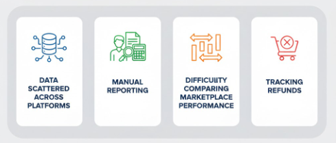
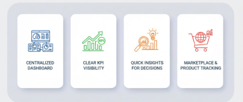
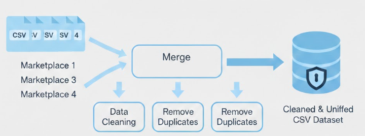
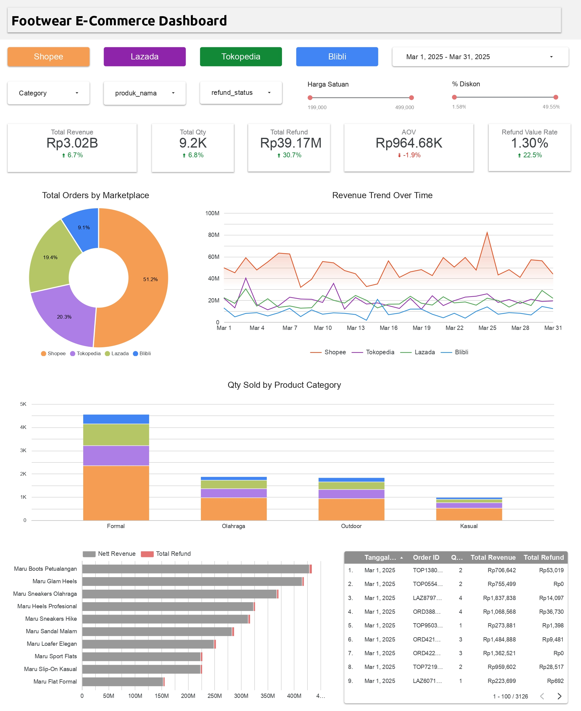

# Toko Maru Footwear – Integrated E-commerce Dashboard Project
---
Domain Proyek: E-commerce & Retail Analytics

  

Project ini berfokus pada analisis performa penjualan **Toko Maru Footwear** di berbagai marketplace online untuk mendukung pengambilan keputusan bisnis berbasis data.

---

## Business Understanding

### Latar Belakang Masalah
Maru Footwear memasarkan produknya melalui beberapa marketplace, seperti Shopee, Tokopedia, Lazada, dan Blibli.  
Namun, data penjualan dari masing-masing marketplace **terpisah dan belum terintegrasi**, sehingga menyulitkan perusahaan untuk mendapatkan gambaran performa bisnis secara menyeluruh.

Beberapa tantangan utama yang dihadapi:

  

- Sulit mengetahui **total revenue dan nett revenue** secara akurat
- Tidak mudah membandingkan performa antar marketplace
- Evaluasi **refund** dan dampaknya terhadap pendapatan belum optimal
- Informasi kontribusi kategori produk belum tersedia secara ringkas
- Proses pelaporan masih memakan waktu dan kurang efisien

### Business Objective

  

- Menyediakan satu dashboard terintegrasi dan dapat difilter per marketplace
- Memantau performa penjualan secara real-time
- Mengidentifikasi marketplace & kategori produk dengan kontribusi terbesar
- Mendukung keputusan marketing dan inventory

---

## Data Understanding

### Data Scope
Data yang digunakan merupakan **data penjualan dari 4 marketplace**, dengan cakupan sebagai berikut:

| Variabel | Deskripsi |
|----------|-----------|
| order_id | ID unik setiap transaksi |
| tanggal_order | Tanggal transaksi/order dilakukan |
| marketplace | Marketplace tempat transaksi terjadi (Shopee, Tokopedia, Lazada, Blibli) |
| produk_id | ID unik setiap produk |
| produk_nama | Nama produk yang dijual |
| kategori | Kategori produk (Formal, Olahraga, Outdoor, Kasual) |
| qty | Jumlah unit yang dipesan per transaksi |
| harga_satuan | Harga per unit produk |
| total_order | Nilai total transaksi sebelum diskon dan ongkir |
| diskon | Nilai diskon yang diberikan |
| ongkir | Biaya ongkos kirim per transaksi |
| status | Status transaksi |
| refund_status | Status refund |
| refund_amount | Nilai refund jika ada |

### Key Variables

Variabel kunci yang digunakan untuk analisa dan pengambilan keputusan bisnis meliputi:

| Variabel | Deskripsi |
|----------|-----------|
| Total Order (Revenue) | Total nilai transaksi per periode |
| Order Quantity | Jumlah transaksi/produk yang terjual |
| Refund Amount & Refund Rate | Nilai refund dan persentase pengembalian |
| Average Order Value (AOV) | Rata-rata nilai transaksi per order |
| Nett Revenue | Revenue bersih setelah dikurangi refund |
| Product Name | Nama produk untuk analisis performa |
---

## Data Preparation

  

1. Merge
   - Semua file digabung menjadi satu dataset utama dengan order_id 
   - Proses ini memastikan setiap transaksi tercatat secara kronologis dan tidak ada duplikasi.

2. Data Cleaning
   - Menghapus kolom yang tidak relevan atau redundan.  
   - Memastikan format tanggal, numerik, dan kategori konsisten di seluruh dataset.  
   - Menangani data agar siap untuk analisis.

3. Hasil Akhir
   - Dataset menjadi **satu file bersih**, siap untuk analisis, visualisasi di Looker Studio, dan pembuatan dashboard interaktif.  
   - Semua transaksi dari 4 marketplace sekarang terintegrasi dalam format yang konsisten.

---

## Dashboard Development

  

Click here: [Live Footwear E-Commerce Dashboard](https://lookerstudio.google.com/embed/reporting/d0f763b0-1e38-468c-a9c6-1aa17e1fd884/page/ZlJlF)  

Dashboard dibangun dengan fitur utama berikut:
- Ringkasan KPI (Revenue, Order, Refund, AOV)
- Tren revenue per marketplace
- Distribusi order per marketplace
- Kontribusi kategori produk
- Top produk berdasarkan nett revenue
- Filter interaktif (tanggal, marketplace, kategori, dan produk)

Key Insights

- **Shopee** menjadi kontributor revenue terbesar
- **Kategori Formal** menghasilkan volume penjualan tertinggi
- **Refund rate (~1.3%)** tergolong rendah dan sehat
- AOV menunjukkan penurunan ringan, membuka peluang optimasi bundling
- Pola revenue meningkat pada periode kampanye

---

## Business Impact

- Monitoring performa penjualan lebih cepat & efisien
- Insight lebih jelas untuk strategi marketing & inventory
- Mengurangi ketergantungan pada laporan manual
- Mendukung pengambilan keputusan berbasis data

---

## Tools 

    

---

## Contact Me

Saya terbuka untuk diskusi, kolaborasi, atau pertanyaan terkait data analytics dan dashboard projects.

- **Email:** [indriwindriasari2511@gmail.com](mailto:indriwindriasari2511@gmail.com)  
- **LinkedIn:** [Indri Windriasari](https://www.linkedin.com/in/indriwindriasari)  
- **GitHub:** [driins](https://github.com/driins)  
