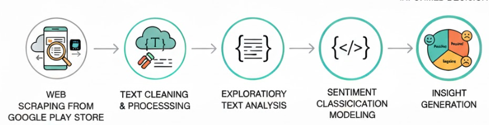

 # Analisis Sentimen Aplikasi Mobile PLN dari Google Play Store

## Ringkasan Proyek
Proyek ini melakukan **analisis sentimen** terhadap review pengguna pada aplikasi mobile di **Google Play Store**.  
Tujuannya adalah mengekstrak insight yang dapat mendukung **strategi pemasaran** dan **perbaikan produk** dan membuat model machine learning untuk sentimen.  

**Domain:** Marketing Analytics / Analisis Pengalaman Pengguna  

Proyek ini mendemonstrasikan alur **end-to-end**, dari **pengumpulan data** hingga **insight extraction dan model development**, menekankan kemampuan terkait faktor dan isu positif negatif apa saja terhadap aplikasi mobile pln.

---

## Alur Kerja Proyek

Alur kerja proyek terbagi menjadi lima tahap. Klik nama tahap untuk menuju folder dan skrip terkait:

- **[Pengumpulan Data: Scraping Data Review dari Google Play Store](https://github.com/driins/data-portofolio/blob/main/projects/01-sentiment-analysis-pln-mobile-app/1.%20Scraping_PLN_Mobile_Review_Data.ipynb)**  
- **[Pembersihan & Pra-pemrosesan Data & EDA](https://github.com/driins/data-portofolio/blob/main/projects/01-sentiment-analysis-pln-mobile-app/2.%20Preprocessing_PLN_Mobile_Review_Data.ipynb)**  
- **[Pengembangan & Pelatihan Model](https://github.com/driins/data-portofolio/blob/main/projects/01-sentiment-analysis-pln-mobile-app/3_Modelling_Test_PLN_Sentiment_Analysis.ipynb)**  

---

## Hasil Scraping dari Google Play Store
- Total **review yang dikumpulkan**: **184,500**  
- Struktur data setiap review mencakup **11 kolom**:

| Kolom | Deskripsi |
|-------|-----------|
| `reviewId` | ID unik review |
| `userName` | Nama pengguna yang memberi review |
| `userImage` | Foto profil pengguna |
| `content` | Isi review / komentar pengguna |
| `score` | Rating bintang dari 1–5 |
| `thumbsUpCount` | Jumlah likes pada review |
| `reviewCreatedVersion` | Versi aplikasi saat review dibuat |
| `at` | Tanggal review dibuat |
| `replyContent` | Balasan resmi dari developer (jika ada) |
| `repliedAt` | Tanggal balasan (jika ada) |
| `appVersion` | Versi aplikasi saat review dikirim |

> Data ini menjadi **dasar utama analisis sentimen** dan pembuatan model klasifikasi.

---

## Data Cleaning & Preprocessing

Tahap ini bertujuan untuk memastikan data teks dari hasil scraping siap digunakan untuk **analisis sentimen** dan **pemodelan machine learning**.  
Fokus utama adalah meningkatkan **kualitas data teks**, mengurangi noise, dan menstandarkan format data.

### 1. Seleksi Kolom
Tidak semua kolom hasil scraping digunakan untuk analisis sentimen.  
Kolom yang difokuskan pada tahap ini adalah:

- `content` → teks utama review (fitur utama)
- `score` → rating bintang (digunakan untuk analisis tambahan & validasi)
- `thumbsUpCount` → indikator engagement
- `at` → waktu review dibuat
- `appVersion` → versi aplikasi (opsional untuk segmentasi)

Kolom seperti `userImage` dan metadata yang tidak relevan dengan sentimen tidak digunakan dalam pemodelan.

---

### 2. Pembersihan Data (Data Cleaning)

Langkah-langkah pembersihan yang dilakukan:

- Menghapus review dengan:
  - Teks kosong atau `null`
  - Panjang teks terlalu pendek (misalnya hanya 1–2 karakter)
- Menghapus duplikasi review berdasarkan `reviewId`
- Mengonversi seluruh teks menjadi **lowercase**
- Menghapus:
  - URL
  - Emoji
  - Angka
  - Tanda baca
  - Karakter non-alfabet

Tujuan utama tahap ini adalah mengurangi **noise** yang dapat memengaruhi performa model.

---

### 3. Pra-pemrosesan Teks (Text Preprocessing)

Setelah data bersih, dilakukan pra-pemrosesan teks sebagai berikut:

- **Tokenization**  
  Memecah teks review menjadi kata-kata individual.
  
- **Stopwords Removal**  
  Menghapus kata umum yang tidak memiliki makna sentimen kuat  
  (contoh: *dan, yang, di, untuk*).

- **Stemming / Lemmatization**  
  Mengubah kata ke bentuk dasar  
  (contoh: *membantu → bantu*, *berjalan → jalan*).

Tahap ini membantu model fokus pada **kata-kata bermakna** yang merepresentasikan opini pengguna.

---

### 4. Label Preparation (untuk Modeling)
Label sentimen disiapkan menggunakan pendekatan berikut:

- **Rating-based labeling (opsional):**
  - Rating 4–5 → Positif
  - Rating 3 → Netral
  - Rating 1–2 → Negatif

atau

- **Model-based labeling** (jika menggunakan supervised learning dengan data berlabel)

Pendekatan ini memudahkan proses pelatihan model klasifikasi sentimen.

---

### 5. Output Data Preprocessing
Hasil akhir dari tahap ini adalah dataset siap model dengan karakteristik:

- Teks sudah bersih dan terstandarisasi (
- Tidak mengandung duplikasi atau missing value
- Siap digunakan untuk dilakukan pemodelan
  
---

## Hasil Utama
- Berhasil **mengumpulkan dan membersihkan ribuan review** dari Google Play Store 
- Membangun **model klasifikasi sentimen** untuk mengkategorikan review menjadi **positif, netral, atau negatif**.  
- Menghasilkan insight yang mendukung **perbaikan produk** dan **strategi pemasaran**.  
- Mendokumentasikan workflow **end-to-end**: **[Scraping → Preprocessing → Modeling → Evaluation]**.

---

## Tools & Teknologi
- **Pengumpulan Data (Crawling / Scraping Data) :** Python, BeautifulSoup, Google Play Scraper  
- **Pra-pemrosesan Data:** Pandas, NLTK / spaCy, Regex  
- **Exploratory Data Analysis:** Matplotlib, Seaborn, WordCloud  
- **Pemodelan:** Scikit-learn, XGBoost, Logistic Regression, Random Forest  
- **Manajemen Workflow:** Jupyter Notebook, GitHub  

---

## Related Skills
Web Scraping | Pra-pemrosesan Teks | NLP | Analisis Sentimen | Machine Learning | Visualisasi Data | Marketing Analytics  

---

## Contact Me

Saya terbuka untuk diskusi, kolaborasi, atau pertanyaan terkait data analytics dan dashboard projects.

- **Email:** [indriwindriasari2511@gmail.com](mailto:indriwindriasari2511@gmail.com)  
- **LinkedIn:** [Indri Windriasari](https://www.linkedin.com/in/indriwindriasari)  
- **GitHub:** [driins](https://github.com/driins)  

